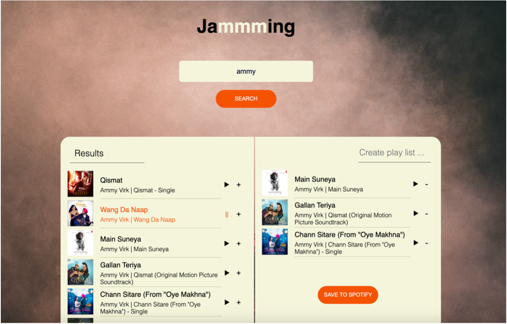
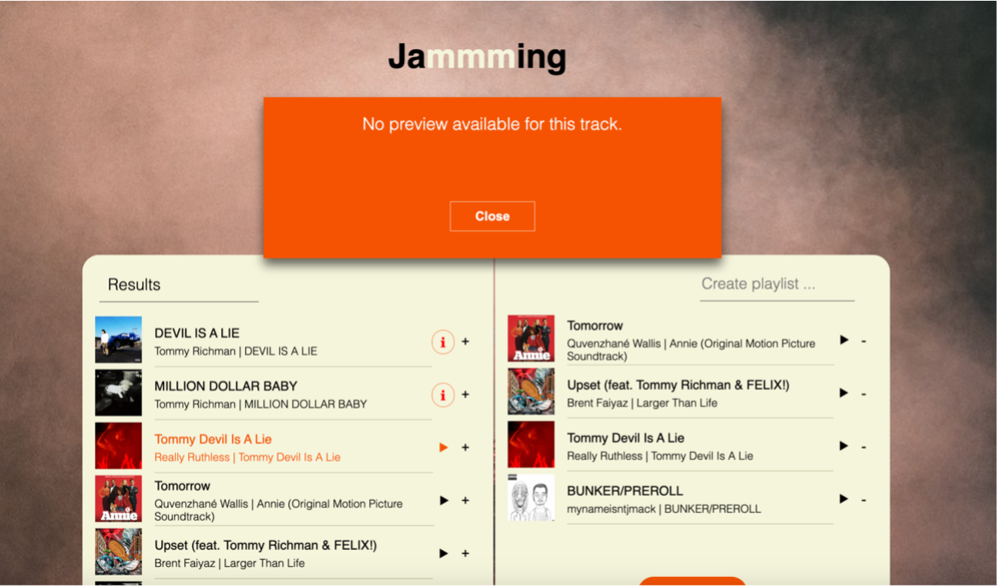
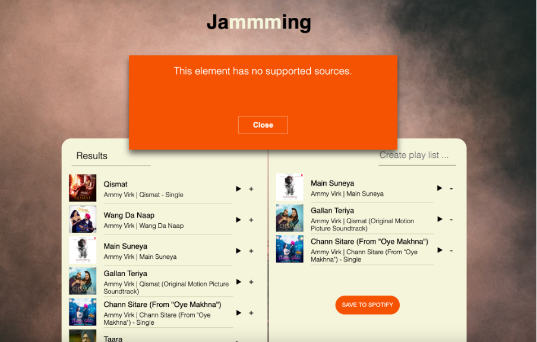

# Technical Design Document for Jammming
## June 20th 2024

 ### 1.  Objectives
The primary objective of the Jammming project is to create a web application that allows users to interact with the Spotify library. Users can search for songs, view detailed information about them, create custom playlists, and save these playlists directly to their Spotify account. The application aims to provide an intuitive and engaging user experience for music enthusiasts.

### 2.  Background
Jammming leverages the power of the Spotify API to access a vast library of music. The application is built using React, which allows for efficient state management and component-based architecture. The project integrates authentication to ensure secure access to user data and playlists on Spotify.

### 3.  Technical Design
#### 3.1  Architecture Overview
The application follows a client-server architecture, where the client is a single-page application built with React, and the server-side interactions are managed through HTTP requests to the Spotify API.

#### 3.2  Technologies Used
* **HTML:** Provides the basic structure of the web application.
* **CSS:** Used for styling the application and ensuring a responsive and visually appealing design.
* **JavaScript:** Core programming language used to build the application's functionality.
* **React:** JavaScript library used for building user interfaces and managing state.
* **HTTP** Requests and Responses: Used to interact with the Spotify API to fetch and manipulate data.
* **Authentication:** Implemented to securely access and modify user playlists on Spotify.

#### 3.3  Features
##### 1. **Search Functionality:**
  * Users can search for songs by song title, artist name, genre, and other attributes.
  * Utilizes Spotify's search endpoints to retrieve relevant results.

 ##### 2. Song Information Display:
  * Displays detailed information about each song, including title, artist, and album.
  * Includes album images and track samples for a richer user experience.

 ##### 3. Custom Playlist Creation:
  * Users can create custom playlists by adding songs from the search results.
  * Playlists can be named and managed within the application.

 ##### 4. Export to Spotify:
  * Users can export their custom playlists to their personal Spotify account.
  * Requires user authentication to ensure secure access to the user's Spotify data.

 ##### 5. Error Handling:
  * Displays an error message if a track's sample cannot be played due to unsupported 
    sources.
  * Ensures a smooth user experience by providing clear feedback.

  
  

#### 3.4  Component Breackdown
* **App:** The root component that manages the overall state and renders other components.
* **SearchBar:** Allows users to input their search queries.
* **SearchResults:** Displays the search results fetched from the Spotify API.
* **Playlist:** Manages and displays the user's custom playlist.
* **Track:** Represents an individual track, displaying relevant information and playback 
  controls.
* **ErrorMessage:** Displays error messages for unsupported track samples.

#### 3.5  State Management
State is managed at various levels of the component hierarchy to ensure efficient data flow and reactivity. Key states include search results, current playlist, playback status, and error messages.

#### 3.6  API Integration
The application interacts with the Spotify API using HTTP requests. Key endpoints used include:
  * **Search Endpoint:** To fetch songs based on user queries.
  * **User Playlist Endpoint:** To create and modify user playlists.
  * **Authentication Endpoint:** To manage user authentication and secure API access.

#### 3.7  Authentication
The application uses Spotify's OAuth 2.0 authentication flow to securely authenticate users. This allows the application to perform actions on behalf of the user, such as creating and modifying playlists.

### 4.  Caveats
* **API Rate Limiting:** The Spotify API has rate limits that can affect the application's 
  performance if too many requests are made in a short period.
* **Cross-Origin Resource Sharing (CORS):** Ensuring proper CORS settings is essential to avoid issues when making API requests.
* **Authentication Flow:** Handling token expiration and refresh tokens adds complexity to the authentication process.
* **Unsupported Sources:** Some tracks may not have a playable sample, which requires graceful error handling.

### 5. Future Work
* **Enhanced Search Filters:** Adding more advanced search filters to allow users to find songs based on additional attributes.
* **User Feedback:** Implementing user feedback mechanisms to improve the application based on user suggestions.
* **Mobile Optimization:** Enhancing the mobile responsiveness and usability of the application.
* **Social Features:** Adding social features such as sharing playlists with friends and collaborative playlist creation.
* **Advanced Error Handling:** Improving error handling mechanisms to cover more edge cases and provide better user feedback.

---
_This technical design document outlines the structure, functionality, and future plans for the Jammming project. The application aims to provide a seamless and enjoyable experience for users to explore and manage their music using the Spotify library._

